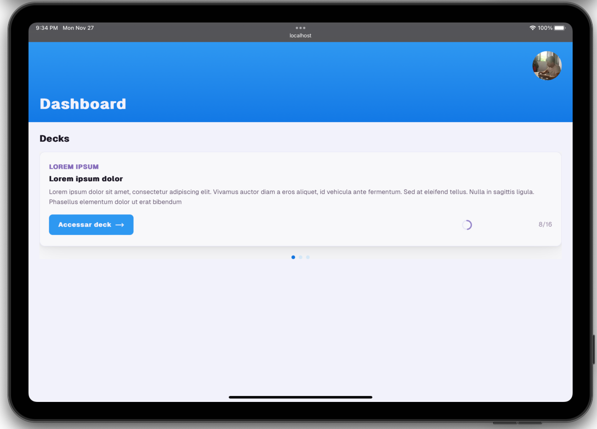
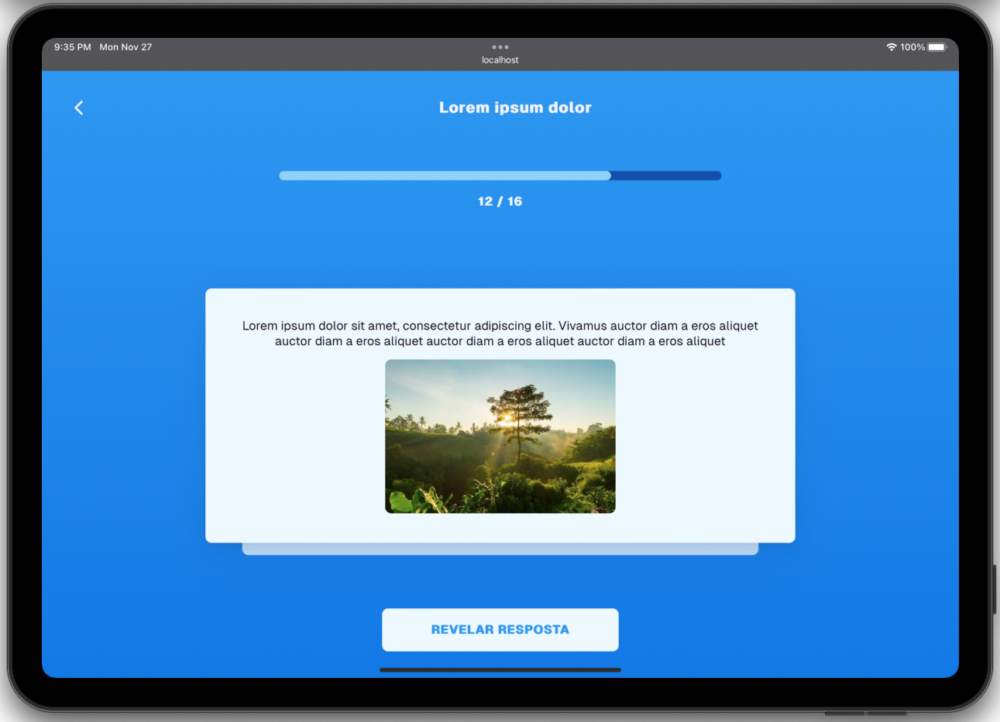

# Flashcards

This app allows users to create, manage and resolve flashcards.

## Preview

<div style="width: 100%;">
   
   
</div>
## Features

-  User registration and authentication
-  CRUD operations for flashcards
-  Flashcard deck management
-  Study mode with flashcard randomization
-  Responsive and user-friendly interface

## Requirements

To run this app locally, you need to have the following installed:

-  Node.js
-  Docker

## Getting Started

### Installation

1. Clone the repository:

   ```bash
   git clone https://github.com/your-username/flashcards-app.git
   ```

2. Install the dependencies:

   ```bash
   cd flashcards-app
   npm install
   ```

### Running the App

1. Start the MongoDB server.

2. Run the app:

   ```bash
   npm run dev
   ```

   This will start both the backend server and the frontend client.

3. Open your browser and navigate to `http://localhost:3000` to access the app.

## Contributing

Contributions are always welcome! If you have any ideas, bug reports, or feature requests, please open an issue or submit a pull request.
